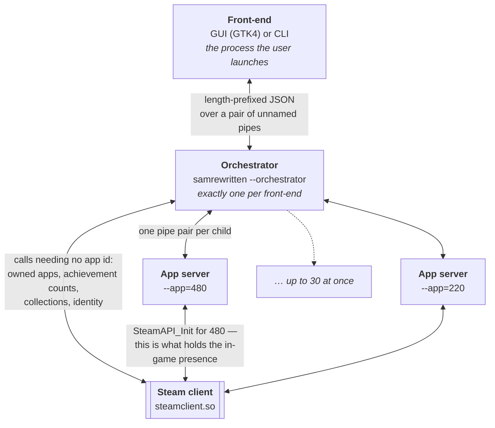
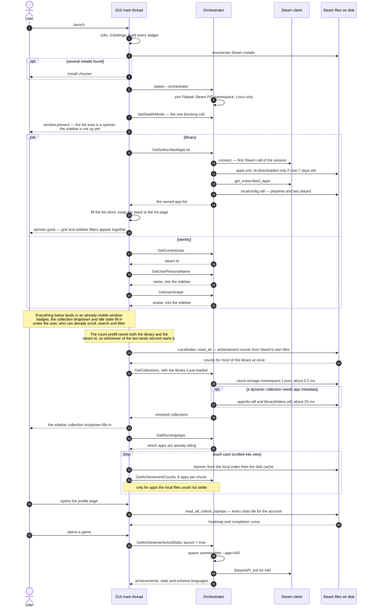

# SamRewritten — Architecture

## Process model



Three kinds of process. They are all the same binary (`samrewritten`); the
role is selected by command-line flags routed in `src/main.rs`.

* **Front-end** — one user-facing process. GUI build embeds GTK4; CLI build
  uses clap subcommands. This is the parent process the user actually
  launches.
* **Orchestrator** — long-lived child of the front-end, spawned at startup
  with `--orchestrator` by **both** the GUI and the CLI. It owns every Steam
  connection: its own (used only for listing owned apps and achievement
  counts, and established lazily on first use) plus a refcounted map of live
  app-server children. It is the **sole spawner of app-server children**,
  including the concurrent fan-out for bulk operations.
* **App servers** — child processes invoked with `--app=<id>`. Each calls
  `SteamAPI_Init` for one specific app id and runs the command loop in
  `backend::app::app`. They can be long-lived (idling, manage view) or
  short-lived one-shots (bulk ops, single-app unlock/reset).

The orchestrator does not call Steam app functions itself because Steam
keeps "in-game" presence alive as long as the process holding the app's
Steamworks handle is alive (and not reaped). Each app server is therefore
the "I'm running game X" presence holder.

## Inter-process communication

* Each parent ↔ child link is two `interprocess::unnamed_pipe` pipes, one
  per direction, wrapped in `utils::bidir_child::BidirChild`. Pipe file
  descriptors / handles are passed to the child via `--tx=` / `--rx=`
  args.
* Messages are length-prefixed JSON-serialized `SteamCommand` requests and
  `SteamResponse<T>` replies (`utils::ipc_types`). JSON was chosen over a
  binary codec for ease of inspection; it has not been a bottleneck.
* Both front-ends share the `Request` trait in
  `backend::orchestrator_client`: each request type maps to one
  `SteamCommand` and declares its response shape. A global `ORCHESTRATOR`
  holds the single orchestrator `IpcClient`; `Request::request()` takes the
  lock to serialize traffic on that pipe. (`gui_frontend::request` is a thin
  re-export kept for the GUI's existing imports.)

## Loading order in the GUI

Nothing in the front-end blocks on Steam. Every front-end to orchestrator call
runs on a `spawn_blocking` worker with a `MainContext::spawn_local`
continuation, so the window stays interactive from the moment it appears; the
one deliberate exception is marked below.



### Before the window exists

`create_main_ui` runs to completion first: translations, GSettings, and the
**whole** widget tree — app list, manage view, sidebar and profile page are all
built up front, then swapped by `GtkStack` rather than constructed on demand.
No Steam call has happened at this point and nothing has been read from disk
except the compiled schema and the install enumeration. If more than one Steam
install is present, the chooser dialog blocks here, before the main window.

### At `window.present()`

The orchestrator child already exists, has joined the Flatpak PID namespace if
needed, and has answered one **synchronous** `SetStealthMode` on the main
thread. The window then opens on a spinner and the library request is already
in flight. The sidebar is not visible yet: it lives *inside* the stack's list
page rather than beside the stack, so the filters arrive with the grid, not
before it.

### Two independent branches

The library (`GetSubscribedAppList`) and the identity (`GetCurrentUser`, then
name, then avatar) are unrelated requests racing each other. The identity chain
is sequential because each step needs the steam id from the first.

`GetSubscribedAppList` is the first thing to actually touch Steam, so the
orchestrator's own connection is established there — not at spawn. It is also
the only startup step that makes an HTTP request of its own, and only when the
cached `apps.xml` is more than seven days old; banner downloads come later, one
card at a time.

### When the spinner goes away

The instant `GetSubscribedAppList` returns. The handler fills the list store and
switches `list_stack` to its list page in the same tick, which reveals the grid
and the sidebar together, and re-enables the search entry that was greyed for
the duration.

That switch happens **before** `on_library_loaded()`, so the count prefill and
the collections fetch have not even started when the user first sees the list.
What is on screen at that moment is app names, local banners and playtime;
achievement badges fade in as counts settle, and the collection dropdown holds
nothing but "All games" until `GetCollections` answers.

An empty library, and a library download that failed outright, both still reach
the list page — with an explanatory label where the grid would be, so the
sidebar and the search box stay usable. Any other error is the one case that
never gets there: the stack switches to a separate "disconnected" page instead.

### The rendezvous

`prefill_counts` needs the steam id *and* a non-empty list, so it is called from
both branches and does nothing until the second one arrives. It then reads
achievement counts straight out of Steam's own files for the whole library in
one worker pass — this is why most cards show their count without a single IPC
round trip.

### After the library lands

`on_library_loaded` fires the collection fetch and the idle-state sync. The
collections file is re-read on every refresh rather than cached: it is a few KB,
and Steam rewrites it within a second of any change. `appinfo.vdf` is only
touched when a dynamic collection actually needs it, and then only for the app
ids the caller owns.

### Lazily, while you scroll

Banners resolve local-first (an on-disk index, rebuilt on each refresh), then a
temp-dir cache, then the CDN. Achievement counts for whatever the local files
could not settle are fetched in chunks of 8, prioritised by what is on screen —
a card binding jumps its own app to the front of the queue. A filter or sort
that needs counts escalates this to a full sweep of the library.

### On demand

The profile page reads every unlock timestamp for the account when opened, and
throttles re-reads afterwards (1 s for the tiles, 5 s for the history). Opening
a game spawns a long-lived app server, which is what makes Steam show you as
in-game; idling does the same, and bulk operations spawn short-lived ones.

## Bulk operations

Multi-app operations (export, import, mass unlock, mass reset) are each a
single multi-app command — `ExportApps`, `ImportApps`, `UnlockAllApps`,
`ResetApps` — sent to the orchestrator:

* The front-end sends one of these `SteamCommand`s (via the matching
  `Request`) with the list of app ids.
* The orchestrator's handler builds a `Vec<(app_id, SteamCommand)>` and runs
  `backend::progress_io::run_command_on_apps_concurrent`, which spawns up to
  `MAX_CONCURRENT_APPS` `samrewritten --app=<id>` workers in parallel using
  `std::thread::scope`. Each worker sends the per-app `SteamCommand`, reads
  the response bytes, sends `Shutdown`, and waits the child.
* The orchestrator decodes each child's bytes via `parse_response_bytes::<T>`
  and replies once with `Vec<(app_id, Result<T, SamError>)>` (`bool` for
  unlock/reset, `AppExport` for export, `ImportSummary` for import).

**The orchestrator is the sole spawner of app-server children.** Front-ends
used to fan out themselves, which breaks the Flatpak namespace join (below):
only the orchestrator and its descendants live inside Steam's PID namespace.
Progress reporting for bulk ops is not surfaced over IPC yet.

### The 30-app cap

`MAX_CONCURRENT_APPS = 30` is empirical, not documented by Valve. Past
~30 concurrent `SteamAPI_Init` clients, Steam silently drops in-game
presence (multiple idler tools — Idle Master Extended, Steam Game Idler,
ASF — converge on the same number). It gates both the bulk-op helper's
concurrency and the GUI's "max apps you can idle at once" — greyed-out idle
buttons, driven by `GSteamAppObject.can_start_idling` and `recompute_idle_cap`
in `app_list_view/`. The GUI re-exports the constant as `MAX_CONCURRENT_IDLE`.

## CLI mode

The CLI is a thin IPC client, structurally identical to the GUI: at startup
it spawns one `--orchestrator` child and drives it through the same `Request`
trait, then sends `Shutdown` on exit. It never loads `steamclient.so` itself,
so it benefits from the same Flatpak namespace join.

* Single-app commands (`idle`, `unlock-all`, `list-achievements`, …) map to
  the orchestrator's per-app commands (`LaunchApp`, `GetAchievementsAndStats`,
  `SetAchievement`, `UnlockAllAchievements`, `ResetStats`, …).
* Bulk commands (`export`, `import`) send the multi-app commands above.
* `list-languages` is the one exception: it parses the app's schema file in
  process, so it needs neither Steam nor a launched app.

`main.rs` routes `--orchestrator` and `--app=<id>` in both feature builds, so
the orchestrator and the app-server workers run the same loops
(`backend::orchestrator::orchestrator`, `backend::app::app`) regardless of
which front-end launched them.

## Flatpak Steam (PID-namespace join)

Flatpak runs the Steam client in its own PID namespace. Steam's IPC tracks
each connection's liveness by PID, so a host process — whose PID is
meaningless inside that namespace — has its cross-process pipe reaped
mid-call (the "broken pipe" failure). The fix is to put every process that
loads `steamclient.so` inside Steam's PID namespace.

* `utils::steam_locator` lists the Flatpak install
  (`~/.var/app/com.valvesoftware.Steam/.local/share/Steam`) **first**, so it
  is preferred when present; the GUI shows its usual multi-install warning
  when other installs coexist.
* At orchestrator startup, `utils::steam_ns::enter_flatpak_steam_ns_if_needed`
  (Linux only) checks whether the chosen `steamclient.so` is the Flatpak one.
  If so, it `setns`-es into the running Flatpak's user namespace (granting
  CAP_SYS_ADMIN — unprivileged, since our own uid created it), then its PID
  namespace, then `fork`s; the child becomes the orchestrator. App-server
  children inherit the namespace. The mount namespace is left as the host's
  (so our binary stays reachable) and the network namespace is already shared
  (Steam IPC is loopback TCP).
* This requires an **unconfined** binary — the AppImage works; a
  strict-confined Snap of SamRewritten cannot `setns` and falls back with a
  warning.
* Quitting Flatpak Steam tears down its PID namespace, `SIGKILL`-ing the
  orchestrator and its children; the front-ends then see the orchestrator
  pipe close.

## Progress export/import format

`samrewritten export` and the GUI's "Export selected apps progress" produce:

```json
{
  "format_version": 1,
  "exported_at": "2026-05-14T10:30:00Z",
  "apps": [{
    "app_id": 440,
    "app_name": "Team Fortress 2",
    "achievements": [{"id": "...", "is_achieved": true, "permission": 0}],
    "stats": [{"id": "...", "value": {"int": 100}, "permission": 0},
              {"id": "...", "value": {"float": 0.85}, "permission": 2}]
  }]
}
```

`permission` is preserved so the import side detects fields Steam will
refuse to write:

* stats with `permission & 2 != 0` (PROTECTED bit)
* achievements with `permission != 0` (any flag set: game-server,
  developer)

Protected fields are always skipped client-side on import. The GUI prompts
the user when any selected app contains protected fields, with "Skip
these apps" / "Proceed anyway" choices. The CLI does the same skip
silently (non-interactive).

`unlock_time` is intentionally not exported: Steam stamps a fresh time
on unlock and arbitrary past timestamps can't be restored.

The file format struct and ISO 8601 helper live in
`utils::export_file` (shared between GUI and CLI; the CLI build has no
glib so it uses a hand-rolled UTC formatter).

## Settings (GSettings)

Schema id `org.samrewritten.SamRewritten`
(`assets/org.samrewritten.SamRewritten.gschema.xml`). The schema is
recompiled into `assets/gschemas.compiled` by `build.rs` whenever the
XML changes. It carries a summary and description per key; by group:

* `filter-*`, `app-sort`, `sidebar-visible` — app-list filters, sorting and
  layout, bound in `app_list_view/settings_bindings.rs`.
* `app-theme`, `app-language`, `achievement-language`, `disable-animations` —
  appearance and locale (`gui_frontend/i18n.rs`, `ui_components.rs`).
* `unlock-mode`, `unlock-duration-minutes`, `unlock-spacing`, `auto-fill-*` —
  deferred unlocking (`achievement_manual_view/config_popover.rs`,
  `unlock_queue.rs`, `unlock_scheduler.rs`).
* `copy-timing-*` — copy-timing mode (`achievement_manual_view/copy_mode.rs`).
* `action-journal-enabled` — opt-in change history, off by default.

Loading paths (`gui_frontend::gsettings::get_settings`): `$APPDIR`
(AppImage), `./assets` (dev), `$SAM_GSCHEMA_DIR_FALLBACK`, then the
default system path (`Settings::new(APP_ID)`). The snap build installs
the compiled schema into `$SNAP/usr/share/glib-2.0/schemas/` via the
`snapcraft.yaml` `override-build` step.

## Adding a new per-app command

1. Add a `SteamCommand` variant in `utils/ipc_types.rs`.
2. Handle it in `backend/app.rs` — that's the app-server loop.
3. Add a handler in `backend/orchestrator.rs` (forward the command to the
   live child, or spawn a one-shot) and a `Request` impl in
   `backend/orchestrator_client.rs`.
4. **Bulk fan-out**: add a multi-app variant (`…Apps(Vec<u32>)`) whose
   orchestrator handler maps the ids to per-app commands and calls `fan_out`
   (over `run_command_on_apps_concurrent`).

## Code folders

* **`backend/`** — Steam-facing code, shared between feature builds.
  * `orchestrator.rs` — orchestrator process loop and command dispatch,
    including the bulk `fan_out` helper.
  * `orchestrator_client.rs` — the `Request` trait, request types, and the
    shared `ORCHESTRATOR` handle both front-ends drive.
  * `app.rs` — app-server process loop.
  * `app_manager.rs` — Steam app interface wrapping `ConnectedSteam`.
  * `app_lister.rs` — owned-apps query.
  * `connected_steam.rs` — RAII wrapper over the Steamworks pipe.
  * `progress_io.rs` — `MAX_CONCURRENT_APPS`,
    `run_command_on_apps_concurrent`, `parse_response_bytes`, and the
    per-app `collect_app_export` / `apply_app_export` helpers used by
    app servers.
  * `stat_definitions.rs` — `AchievementInfo`, `StatInfo` (Int/Float),
    permission bit semantics.
  * `local_config.rs` — `localconfig.vdf` parser (playtime, last-played).
  * `steam_collections.rs` — Steam library collections: parses the client's
    on-disk mirror, reproduces Valve's own filter evaluation for dynamic ones,
    and refuses (rather than guesses) any filter it cannot answer faithfully.
  * `app_info.rs` — targeted `appinfo.vdf` reader, used only by the above:
    skips app bodies by their length and decodes just the `common` fields the
    collection filters need.
  * `local_stats.rs`, `key_value.rs` — on-disk fast path for achievement
    counts, over the Steam binary KeyValue parser.
  * `user_unlock_times/` — bulk parse of on-disk unlock timestamps, and the
    friends queries behind copy-timing mode.
* **`gui_frontend/`** — only built with `--features gui` (the default).
  * `app_list_view/` — main grid, search, sort, idle toggle, manage
    button, the bulk-process actions (`bulk_actions.rs`,
    `progress_actions.rs`, `refresh_actions.rs`), and the
    `settings_bindings.rs` GSettings glue.
  * `app_view.rs` — single-app manage view (achievements + stats lists).
  * `achievement_manual_view/` — the achievement list itself, including
    copy-timing mode; `unlock_queue.rs` / `unlock_scheduler.rs` hold deferred
    unlocking and `friend_picker.rs` the friend chooser.
  * `profile_view/` — library stats page: tiles, unlock heatmap
    (`heatmap.rs`), completion curve (`timeline.rs`, `completion_graph.rs`),
    irregular-activity list, and the change-history section
    (`journal_section.rs`).
  * `widgets/` — custom GTK widgets including `SteamAppCard` (hover
    image-pan animation, idle button, sensitivity binding) and
    `ShimmerImage` (async-loaded shimmer-while-loading texture).
  * `gobjects/steam_app.rs` — `GSteamAppObject`, the per-app GObject
    model holding `app_id`, `app_name`, `is_idling`, `can_start_idling`,
    etc.
  * `gsettings.rs` — schema loader handling AppImage / Snap / system
    paths.
* **`cli_frontend/`** — only built with `--no-default-features --features cli`.
  * Clap subcommands. A thin IPC client: spawns one orchestrator and drives
    it through the `Request` trait, exactly like the GUI.
* **`steam_client/`** — raw Steamworks SDK bindings used by `backend`.
* **`utils/`** — feature-agnostic helpers.
  * `ipc_types.rs` — `SteamCommand` (incl. the multi-app `ExportApps` /
    `ImportApps` / `UnlockAllApps` / `ResetApps`), `SteamResponse`,
    `AppExport`, `ImportSummary`, `SamError`.
  * `bidir_child.rs` — `BidirChild` (child + two pipes).
  * `arguments.rs` — `--orchestrator`, `--app=`, `--tx=`, `--rx=` parsing.
  * `app_paths.rs`, `steam_locator.rs` — install path discovery (Flatpak
    listed first).
  * `steam_ns.rs` — Linux Flatpak Steam PID-namespace join.
  * `export_file.rs` — `ExportFile`, `iso8601_utc_now`, `FORMAT_VERSION`.
  * `action_journal.rs` — append-only JSONL change history, and the batch id
    that makes an operation the unit undo works in.
  * `snap.rs` — Snap portal Steam-folder flow.

## Build features

* `default = ['gui']` — GTK4 only.
* `gui = ['dep:gtk']` — GTK4 build.
* `adwaita = ['gui', 'dep:adw']` — GTK4 + libadwaita.
* `cli = ['dep:clap']` — CLI build. Mutually exclusive with `gui`;
  `main.rs` enforces this with `compile_error!`.
* `win-console = ['gui']` — Windows GUI with a console window attached
  (debugging).
